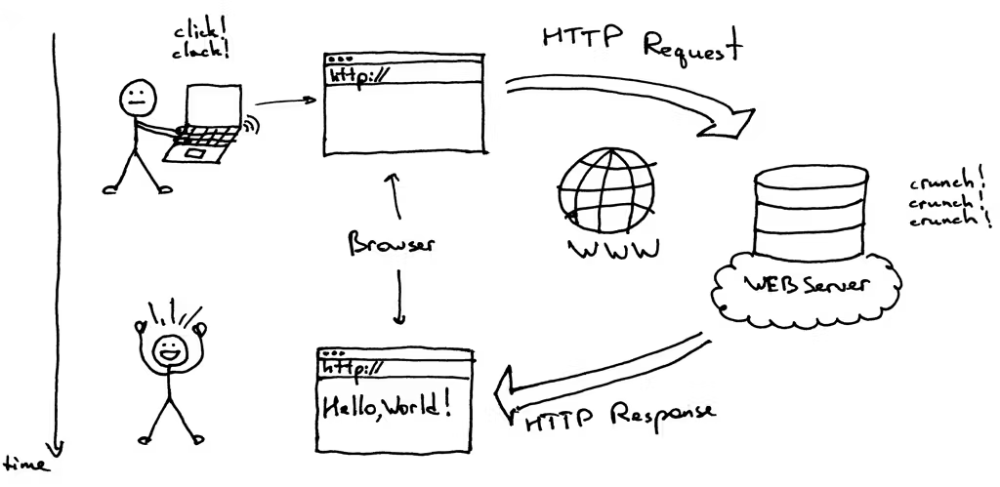

## Week 1 - Getting Started

---V
### What is this course?

This course is an introduction to computer programming specifically designed to enable making music with a computer.

Through a combination of creative activities and projects using high-level program-ming languages students learn foundational pedagogical concepts of computer programming and computational thinking, all within a musical context.


---V

### Objectives
1. learn the fundamental concepts of object-oriented programming,
2. master a working knowledge of computer programming concepts
3. achieve a fundamental knowledge of the JavaScript computer language
4. build graphical user interfaces (GUIs) and interactive musical instruments,
5. be introduced to MIDI input/output objects to enable programs to connect to other electronic devices.

---V
### Objectives
#### _Said another way_

1. Make your own tools tailored to your own goals
2. Develop a broad design-level view (top-down)
3. Have the skills to realize that design (bottom-up)


---V
### Course rhythm
| Day    | Activity |
| -------- | ------- |
| Monday  | Lecture   |
| Wednesday | Workshop|
| Friday    | Lab   |

---H

## HTML + JavaScript in the Browser

---V

In this course we will primarily be building webpages.

---
Thus, it is helpful to understand how websites and the internet work.

---V

### How the Internet Works (Basics)
- The internet is a global network of connected computers
- Your browser uses HTTP (HyperText Transfer Protocol) or HTTPS (secure version) to request web pages
- A server stores the files (HTML, CSS, JavaScript, images, audio) that make up a website
- The server sends these files back to your browser

---V

---

### How the Internet Delivers Files
- You type a web address (URL = Uniform Resource Locator)
- The Domain Name System (DNS) finds the Internet Protocol (IP) address of the server that hosts the site
- Your computer sends a request to that server using HTTP (HyperText Transfer Protocol) or HTTPS (secure version)
- The server responds with files: HTML, CSS, JavaScript, images, and audio

---V


<p style="font-size: small">credit : https://hackernoon.com/http-made-easy-understanding-the-web-client-server-communication-yz783vg3</p>

---V

### The Browser Environment
- A web browser is a computer program that displays web pages and runs code
- It understands three main languages:
  - HTML (HyperText Markup Language) for structure
  - CSS (Cascading Style Sheets) for style
  - JavaScript (JS) for behavior
- JavaScript runs inside the browser, not directly on your operating system

---V

### Rendering Happens on Your Computer
- The browser on your computer receives those files
- It parses the HTML into a Document Object Model (DOM)
- It applies CSS to style the elements
- It runs JavaScript locally in the browser's JavaScript engine
- Multimedia features (like Web Audio or Web MIDI) happen entirely on your machine after the files are loaded

---V


### HTML: The Structure
- HTML stands for HyperText Markup Language
- Defines elements like headings, paragraphs, buttons, images, or audio players
- The browser turns the HTML into the DOM, a tree-like structure of all page elements
- JavaScript can read and change this DOM

---V

### JavaScript: The Behavior
- JS runs in the browser’s JavaScript engine (for example: V8 in Chrome, SpiderMonkey in Firefox)
- JS can:
  - React to user actions (mouse clicks, key presses, motion sensors)
  - Modify the DOM (change text, move elements, control audio or video)
  - Communicate with Application Programming Interfaces (APIs) such as Web Audio or Web MIDI

---V

### Putting It Together
- HTML provides the structure
- CSS provides the visual design
- JS provides the behavior and interactivity
- Together they allow the browser to run interactive audio, video, and multimedia projects


---V

### Why This Matters for Us
- Web Audio and Web MIDI are JavaScript APIs
- The browser provides everything we need to build instruments, effects, and interactive systems
- All you need to begin is:
  1. An HTML page
  2. A small amount of JavaScript
  3. A web browser to run it

---H

## JavaScript


---V


### What is an object?

---V


## Javascript

#### Everything is an Object


- JavaScript (JS) is an **object-oriented programming** (OOP) language
- meaning that we build programs by creating objects that bundle together data (properties) and behavior (methods).


---V

## Javascript

#### Everything is an Object


We'll _think_ in **objects**: properties (data) + methods (actions)


---V


## Web Audio

The Web Audio API is a JavaScript toolkit for creating, processing, and controlling audio directly in the web browser.


---V

## JS + Web Audio

#### Everything is an Object
_mindset &rarr; AudioContext &rarr; first sound_

---V

### EVERYTHING IS AN OBJECT
---
### OBJECTS HAVE PROPERTIES AND METHODS


---H
## Goals & Syllabus

- Goals:
  - OOP mindset (objects everywhere)
  - JS fundamentals (variables, functions, loops)
  - Web Audio, MIDI, interactive instruments
- Assessments:
  - In-class labs, 2 oral exams, projects
- Expectation: experiment, break things, ask questions
- We'll use Canvas

---H

## Everything Is an Object

- Real world: <span class="fragment">piano</span>
  - **properties**: <span class="fragment">keys, tuning</span>
  - **methods**: <span class="fragment">playNote(), sustainOn()</span>
- Programming world:<span class="fragment"> *same idea*
  - Object = container of **data** + **behavior**
  - We'll model synths, mixers, effects as objects</span>

---V

### Object Shape in JavaScript

```js
const piano = {
  keys: 88,                 // property (data)
  tuning: "equal temperament",
  playNote(note) {          // method (action)
    console.log("playing", note);
  }
};

piano.playNote("C4");       // call a method
console.log(piano.keys);    // read a property
```

Key idea: **dot notation** to access **properties** and call **methods**.

---H

## Web Audio: 
### The World = AudioContext

* `AudioContext` is a special object that we can create.
* Think of it as the environment in which we'll make sound.

    * You **create** nodes *inside it*
    * You **connect** nodes into a graph

---V

### Minimal audio graph:

Oscillator &rarr; Gain &rarr; Destination (speakers)


<span style="font-size: large">Browser note: audio usually starts **suspended**; resume after user gesture</span>

---V

### Minimal audio graph:

```js
// 1) Make the audio context
const ctx = new AudioContext();

// 2) Make instruments/mixer
const osc  = new OscillatorNode(ctx); // OscillatorNode
const gain = new GainNode(ctx);       // GainNode

// 3) Wire it up
osc.connect(gain);
gain.connect(ctx.destination);

// 4) Set properties, then act
gain.gain.value = 0.2;  // property
osc.start();            // method
```
---V
### Minimal audio graph:
**Vocabulary check**

* objects: `osc`, `gain`
* properties: `gain.gain.value`
* methods: `.connect()`, `osc.start()`

---V

### What Changes the Sound?

* **Loudness** &rarr; `gain.gain.value`
* **Pitch** &rarr; `osc.frequency.value`
* **Timbre** &rarr; `osc.type` (`sine`, `square`, `sawtooth`, `triangle`)

```js
gain.gain.value = 0.1;       // quieter
osc.frequency.value = 660;   // higher pitch
osc.type = "square";         // different tone
```

---H


### Patterns You'll See All Semester

* **Create &rarr; Connect &rarr; Configure &rarr; Start/Stop**
* Everything is an **object**

    * Properties (nouns) - `node.param.value`
    * Methods (verbs) - `node.start()`, `node.connect()`
* Keep a **master GainNode** before `ctx.destination`

---H

### What's Next

**Wednesday (Workshop)**

* Bring your laptop
* Install necessary software
* Build the same graph together, from scratch
* Add a button

**Friday (Lab)**

"Hello, Audio" - your first WebAudio app


