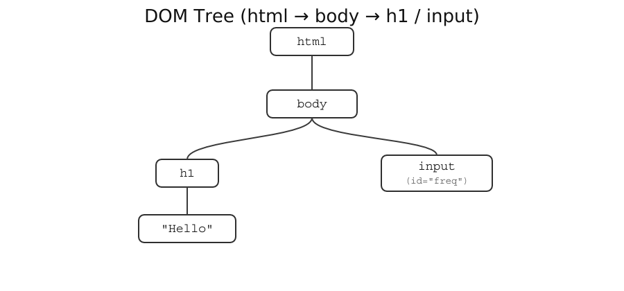

## Week 2: JS + DOM + Web Audio
Note: Quick roadmap: review &rarr; DOM as objects &rarr; sliders/events &rarr; Web Audio basics &rarr; mixin
---H
## Review from Week 1
- `let`, `const`
- `console.log`
- `AudioContext`
- `OscillatorNode`
- `GainNode`
Note: Quick refresh so terms are top-of-mind.
---V
### Everything is an object
- Objects have **properties**
- Objects have **methods**

```js
const obj = { x: 5, y: 10 };
console.log(obj.x);       // property
console.log(Object.keys(obj)); // method
```
Note: Anchor the mental model: we "get/set properties" and "call methods."

---H

## Variables

* Variables store objects (numbers, strings, AudioNodes&hellip;)
* `const` = cannot reassign
* `let` = can reassign

Variables allow us to keep track of and work with object.


```js
const course = "CPM";
let counter = 0;
counter = counter + 1;
console.log(course, counter);
```
Note: Keep it simple—name, store, reuse.
---H
## Arithmetic Operators

| Op. | Meaning        | Code     |Result             |
|------|----------------|----------|-------------------|
| `+`  | Addition       | `2 + 3`  |$2+3=5$            |
| `-`  | Subtraction    | `7 - 4`  |$7-4=3$            |
| `*`  | Multiplication | `6 * 2`  |$6\times2=12$      |
| `/`  | Division       | `10 / 4` |$\frac{10}{4}=2.5$ |
| `%`  | Remainder      | `10 % 4` |$10\mod4=2$        |
| `**` | Exponents      | `2 ** 3` |$2^3=8$            |

Note: Tie operators to pitch math (ratios & octaves).

---V 

## Arithmetic

* Operators: `+ - * / % **`
* Useful for numbers, pitches, timing

```js
const base = 220;
const fifth = base * (3/2); // 330
const octave = base * 2;    // 440
console.log(fifth, octave);
```

---H

## What is the DOM?

* DOM = **Document Object Model**
* Browser turns HTML into a **tree of objects**
* `document` is our entry point into that tree
* Just like Web Audio nodes, it is an **object**

    * Properties (e.g. `document.body`)
    * Methods (e.g. `document.querySelector()`)
  
Note: Stress that document is just another object we can use.

---V
## The DOM
```js
// global Document object, root of the DOM
document;

// some things we can do with it:
document.getElementById("freq");              // method
document.body.style.backgroundColor = "pink"; // property
document.body.innerText = "Hello, Audio";     // property
```

---V

### HTML Tag Anatomy

```html
<p>Hello</p>
```

* **Opening tag**: `<p>`
* **Closing tag**: `</p>`
* **Content**: `Hello`


Each tag becomes an **object** in the DOM with properties (like `.innerText`) and methods.

<iframe
src="../embedded-examples/Week2/w2.1.html"
width="75%" height="50" style="border: 2px solid black; border-radius: 6px;">
</iframe>

Note: Link syntax to the idea that tags become JS-accessible objects.

---V

### HTML Tag Anatomy

```html
<input id="freq" type="range" min="100" max="1000" value="440">
```

* **Attributes**: extra settings inside a tag, e.g. `id="freq"`, `type="range"`, `min="100"`, etc.
* **Self-closing tags**: don't wrap content, e.g. `<input ... >`

Each tag becomes an **object** in the DOM with properties (like `.value`) and methods.

<iframe
src="../embedded-examples/Week2/w2.2.html"
width="75%" height="50" style="border: 2px solid black; border-radius: 6px;">
</iframe>

---V


### DOM Tree Example

```html
<html>
    <body>
        <h1>Hello</h1>
        <input id="freq" type="range" />
    </body>
</html>
```


<div style="display:flex; gap:5%; align-items:center;">
  

<iframe
src="../embedded-examples/Week2/w2.3.html"
width="20%" height="300" style="border:1px solid #ccc;">
</iframe>
</div>
Note: Show structure &rarr; objects; pair static diagram with a tiny live DOM.
---H

### DOM: Accessing Elements

* JavaScript needs a way to **find** elements in the DOM tree
* The `document` object gives us methods to do that
* `document.querySelector("CSS selector")`
  - Takes a **CSS-style selector string** (like `#id`, `.class`, `tagname`)
  - Returns the **first matching element object**
  - We will primarily use the `#id` method.

Note: Emphasize "grab &rarr; store &rarr; then use properties and methods."
---V
### DOM: Accessing Elements
* To work with an element, first **grab it**
* Store it in a variable (just like `osc` or `gain`)

```html
<input id="freq" type="range" min="100" max="1000" value="440">

<script>
  const slider = document.querySelector("#freq"); // grab object by id
  console.log(slider); // prints the <input> element
</script>
```
Open the console and take a look
<iframe
        data-src="../embedded-examples/Week2/w2.4.html"
        width="75%" height="50" style="border: 2px solid black; border-radius: 6px;">
</iframe>
---V

### DOM: Getting values


* `.value` gives the current slider position

```html
<input id="freq" type="range" min="100" max="1000" value="440">

<script>
  const slider = document.querySelector("#freq");
  console.log(slider.value);         // "440" (string)
</script>
```
Open the console and take a look
<iframe
data-src="../embedded-examples/Week2/w2.5.html"
width="75%" height="50" style="border: 2px solid black; border-radius: 6px;">
</iframe>

Note: Input .value is a string; convert when you need math.

---V

### DOM: Converting values

```js
console.log(typeof slider.value);          // "string"
console.log(typeof Number(slider.value));  // "number"
```
Open the console and take a look
<iframe
data-src="../embedded-examples/Week2/w2.6.html"
width="75%" height="50" style="border: 2px solid black; border-radius: 6px;">
</iframe>

Note: Point out type differences explicitly to avoid silent bugs.
---H

## DOM: Events

* Objects can "listen" for events
  * like input changes, button clicks, mouse hover, ...
* Add with `.addEventListener("input", ...)`

```html
<input id="gain" type="range" min="0" max="1" step="0.01" value="0.2">

<script>
  const gainSlider = document.querySelector("#gain");
  
  gainSlider.addEventListener("input", () => {
    console.log("gain is now", Number(gainSlider.value));
  });
</script>
```
Open the console and take a look
<iframe
data-src="../embedded-examples/Week2/w2.8.html"
width="75%" height="50" style="border: 2px solid black; border-radius: 6px;">
</iframe>

Note: Basic UI loop—read input, update text, repeat on events.
---V


### DOM: Events + Live Feedback

```html
<input id="gain" type="range" min="0" max="1" step="0.01" value="0.2">
<span id="gainDisplay">0.2</span>

<script>
  const gainSlider = document.querySelector("#gain");
  const gainDisplay = document.querySelector("#gainDisplay");
  
  gainDisplay.textContent = gainSlider.value;
  
  gainSlider.addEventListener("input", () => {
    gainDisplay.textContent = gainSlider.value;
  });
</script>
  ```
*(We'll explain* `() => {}` *syntax next week)*
<iframe
  data-src="../embedded-examples/Week2/w2.9.html"
width="75%" height="50" style="border: 2px solid black; border-radius: 6px;">
</iframe>

Note: Basic UI loop—read input, update text, repeat on events.


---H

## Web Audio: Simple Tone


```html
<button id="start">Play</button>
<script>
    const ctx = new AudioContext();
    const osc = new OscillatorNode(ctx);
    const gain = new GainNode(ctx);
    gain.gain.value = 0.2;
    osc.connect(gain);
    gain.connect(ctx.destination);
    
    const startButton = document.querySelector("#start");
    startButton.addEventListener("click", () => {
      ctx.resume();
      osc.start(); 
    });
</script>
```
<iframe
data-src="../embedded-examples/Week2/w2.10.html"
width="75%" height="50" style="border: 2px solid black; border-radius: 6px;">
</iframe>

---V

### Properties vs Methods

```js
osc.type = "triangle";             // property
osc.frequency.value = 165;     // property
gain.gain.value = 0.2;         // property

osc.connect(gain);             // method
gain.connect(ctx.destination); // method
osc.start();                   // method
```
<iframe
data-src="../embedded-examples/Week2/w2.11.html"
width="75%" height="50" style="border: 2px solid black; border-radius: 6px;">
</iframe>

Note: Contrast properties (data you set) vs methods (actions you call).
---H


## Slider controls frequency

```html
<input id="freq" type="range" min="100" max="1000" value="440">

<script>
    const ctx = new AudioContext();        // create AudioContext
    ctx.suspend();                         // prevent auto start
    
    const osc = new OscillatorNode(ctx);   // oscillator
    const gain = new GainNode(ctx);        // gain node
    gain.gain.value = 0.2;                 // set gain
    
    osc.connect(gain);                     // connect osc -> gain
    gain.connect(ctx.destination);         // connect gain -> speakers
    osc.start();                           // start oscillator
    
    const slider = document.querySelector("#freq"); // get slider element
    slider.addEventListener("input", () => {
        ctx.resume();                                      // resume context on input
        osc.frequency.value = Number(slider.value);        // update osc frequency
        document.querySelector("#freqDisplay").textContent = slider.value; // update display
    });
</script>
```
<iframe
data-src="../embedded-examples/Week2/w2.12.html"
width="75%" height="50" style="border: 2px solid black; border-radius: 6px;">
</iframe>

---V

### Slider controls gain

```html
<input id="gain" type="range" min="0" max="1" step="0.01" value="0.2">

<script>
    const ctx = new AudioContext();        // create AudioContext
    ctx.suspend();                         // prevent auto start

    const osc = new OscillatorNode(ctx);   // oscillator
    const gain = new GainNode(ctx);        // gain node
    gain.gain.value = 0.2;                 // set initial gain

    osc.connect(gain);                     // connect osc &rarr; gain
    gain.connect(ctx.destination);         // connect gain &rarr; speakers
    osc.start();                           // start oscillator

    const slider = document.querySelector("#gain"); // get slider element
    slider.addEventListener("input", () => {
        ctx.resume();                                      // resume context on input
        gain.gain.value = Number(slider.value);            // update gain
        document.querySelector("#gainDisplay").textContent = slider.value; // update display
    });
</script>
```
<iframe
data-src="../embedded-examples/Week2/w2.13.html"
width="75%" height="50" style="border: 2px solid black; border-radius: 6px;">
</iframe>
---H

## Mixing Nodes

* Many sources can connect to the same destination

```js
const ctx = new AudioContext();
const master = new GainNode(ctx, );
master.gain.value = 0.125 // ~ -18 dBFS
master.connect(ctx.destination);

const osc1 = new OscillatorNode(ctx, { frequency: 110 });
const osc2 = new OscillatorNode(ctx, { frequency: 330 });
const osc3 = new OscillatorNode(ctx, { frequency: 513.33333 });

osc1.connect(master);
osc2.connect(master);
osc3.connect(master);

document.querySelector("button").addEventListener("click",  () => {
    ctx.resume();
    osc1.start();
    osc2.start();
    osc3.start();
});
```
<iframe
data-src="../embedded-examples/Week2/w2.14.html"
width="75%" height="50" style="border: 2px solid black; border-radius: 6px;">
</iframe>
---V

### Adding a Master Gain Slider

```html
<button>Start</button>
<input id="masterGain" type="range" min="0" max="1" step="0.01" value="0">
<label id="gainDisplay" for="masterGain">0.0</label>
<script>
    const ctx = new AudioContext();
    const master = new GainNode(ctx, );
    master.gain.value = 0.0 
    master.connect(ctx.destination);

    const osc1 = new OscillatorNode(ctx, { frequency: 110 });
    const osc2 = new OscillatorNode(ctx, { frequency: 330 });
    const osc3 = new OscillatorNode(ctx, { frequency: 513.33333 });

    osc1.connect(master);
    osc2.connect(master);
    osc3.connect(master);

    let gainCtl = document.querySelector("#masterGain")
    gainCtl.addEventListener("input", ()=>{
        master.gain.value = Number(gainCtl.value);
        document.querySelector("#gainDisplay").textContent = gainCtl.value;
    })


    document.querySelector("button").addEventListener("click",  () => {
        ctx.resume();
        osc1.start();
        osc2.start();
        osc3.start();
    });

</script>


```

<iframe
data-src="../embedded-examples/Week2/w2.15.html"
width="75%" height="50" style="border: 2px solid black; border-radius: 6px;">
</iframe>


---H

## Wrap Up

- **JavaScript**: variables (`let`, `const`), arithmetic, `console.log`
- **DOM**: tree of objects, tags &rarr; objects, access with `document.querySelector`
- **Events**: sliders give values, `.value` is a property, update in real time
- **Web Audio**: `OscillatorNode`, `GainNode`, `.frequency.value`, `.gain.value`
- **Mixing**: multiple oscillators into one master gain
- **Big idea**: Everything is an object &rarr; properties & methods

---V
